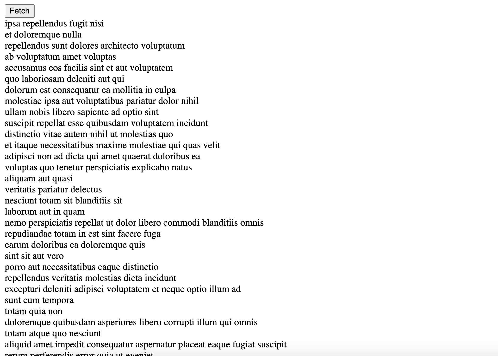
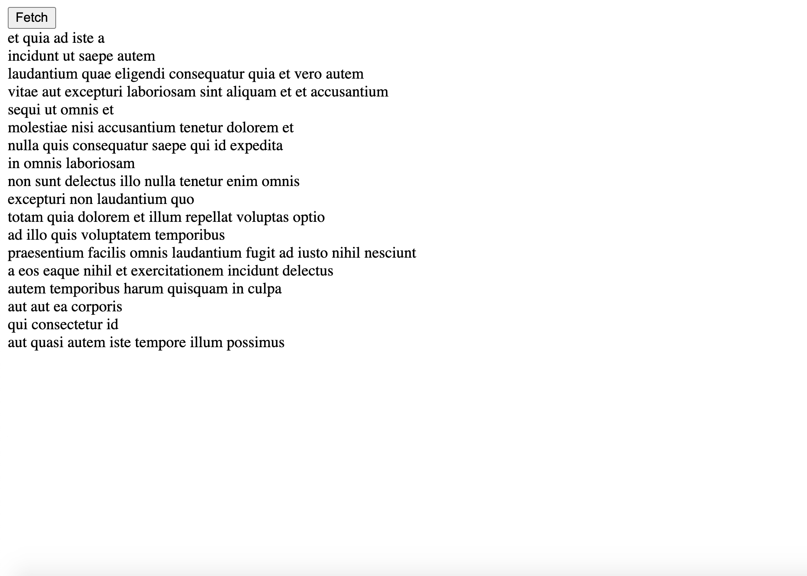

# React Redux TypeScript Render a List
* learn how to use React Redux and TypeScript together to render a mock todo list

# Technologies used
* TypeScript
* React.js
* Redux Library

# API JSONPlaceholder
* Utilize a fake online REST API for Testing
[JSONPlaceholder!](https://jsonplaceholder.typicode.com/)

# Learning Goals
* Learn how to use React Redux and TypeScript together
* Review TypeScript
* Get a deeper understanding of Redux
* Learn more about type definitions and how to use them in conjunction of React, Redux, and TypeScript
* Learn how to implement add and delete functions
* Utilize type alias of action and action type of enums 

